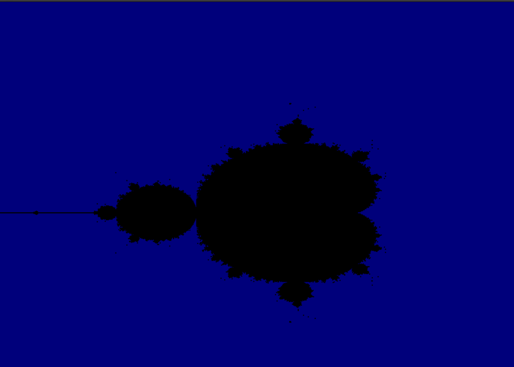

# Mandelbrot Set Visualization


## Introduction 
The Mandelbrot set is one of the most famous fractals in mathematics, defined in the complex plane. It is generated by iterating the function:

```bash
f(z) = z^2 + c 
```
where z and c are complex numbers. The set consists of all points c for which remains the sequence remains bounded. 

## Demo 


## Getting started (MacOs)
1. Copy the git repository 
```bash 
https://github.com/SultanInStem/mandelbrot-set.git
```
2. Activate Env 
``` bash 
source env/bin/activate
```
3. 